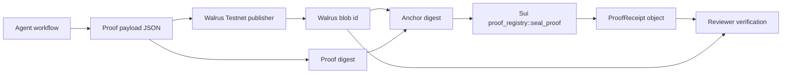

# Walrus Proof Agent

Walrus Proof Agent turns autonomous agent decisions into verifiable audit trails on Sui and Walrus.

AI agents are starting to screen grant applications, execute market actions, and run operational workflows, but their evidence and reasoning are usually locked inside an application log. Walrus Proof Agent stores the full evidence bundle on Walrus and mints a compact Sui `ProofReceipt` object so reviewers can verify what happened without trusting the UI.

- Track: Sui Overflow 2026 Walrus Track
- Live demo: https://walrus-proof-agent.vercel.app
- Repository: https://github.com/dorakingx/walrus-proof-agent
- Status: Sui testnet + Walrus testnet prototype

## What It Does

1. A user connects Slush on Sui testnet.
2. The app publishes the `ProofReceipt` Move package from the browser wallet.
3. The user chooses an agent workflow, such as DAO grant review.
4. The app uploads the proof payload to the Walrus Testnet publisher HTTP API.
5. The app hashes `proofDigest + Walrus blob id + signer`.
6. The app calls `proof_registry::seal_proof`.
7. The UI shows the Walrus blob id, Sui `ProofReceipt` object id, transaction digest, and verification links.

If the package is not published yet, the app can fall back to a deterministic 1 MIST testnet anchor transfer. The preferred judging demo is the `ProofReceipt` path.

## Why Sui And Walrus

- Walrus stores the large evidence bundle: documents, citations, agent output, policy metadata, and replay data.
- Sui stores the compact receipt: Walrus blob id, evidence digest, policy, signer, and timestamp.
- Reviewers can verify the proof from public links instead of trusting the frontend.
- The pattern works for DAO grant review, trading agents, incident response, procurement approvals, and other agentic workflows where auditability matters.

## Architecture



## Verification Path

After a successful demo run, a reviewer can:

1. Open the Walrus blob link and inspect the stored proof payload.
2. Open the Sui transaction link and confirm the transaction succeeded on testnet.
3. Open the `ProofReceipt` object link and confirm the receipt was minted by the package.
4. Recompute the digest from the proof payload, signer, policy, and Walrus blob id.

## Local Development

```bash
npm install
npm run dev
```

## Build

```bash
npm run build
```

## Requirements

- Node.js 22+
- Slush browser extension
- Testnet SUI for gas

## Move Package

The Move source lives in `move/sources/proof_registry.move`. It defines a `ProofReceipt` object and a `seal_proof` entry function. The compiled package bytecode is embedded in the web app so judges can publish it from Slush without a local Sui CLI.

```bash
cd move
sui move build
```

## Submission Notes

See `docs/submission.md` for the judging checklist and `docs/demo-script.md` for the 2-minute demo script.
